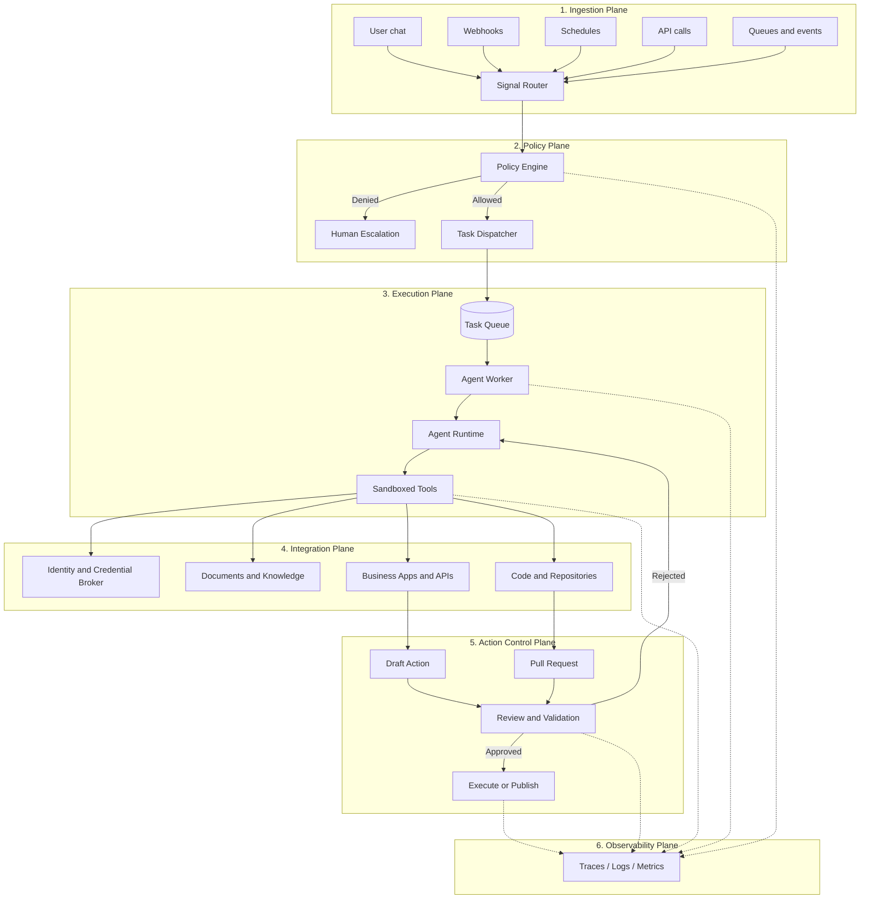
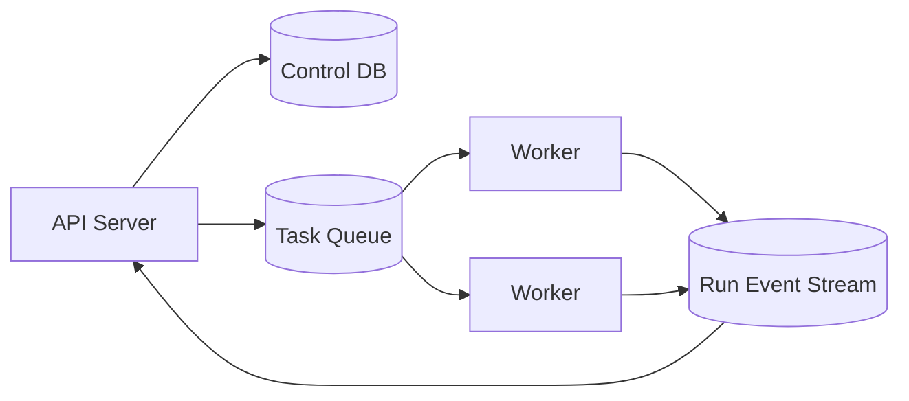
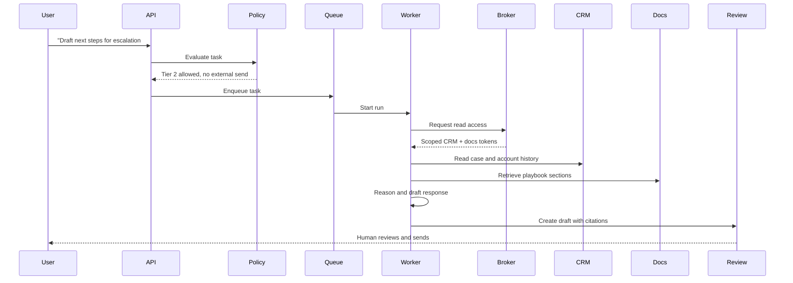

# Chapter 1: Architecture Overview

> The six planes of a production enterprise-agent system.

---

## The Big Picture

An enterprise agent system is not just "an LLM with tools." It is a distributed system where language model output can read sensitive context, call tools, create work artifacts, and sometimes trigger real business actions. The architecture must separate reasoning from authority.

The reference architecture has **six interacting planes**:



---

## Plane 1: Ingestion

Work enters the system from many places. Normalize every signal into a common task envelope before it reaches an agent.

| Signal Source | Example | Trigger Type |
|--------------|---------|--------------|
| User chat | "Summarize this customer escalation and draft next steps" | Interactive |
| Webhook | Ticket created, contract uploaded, PR opened | Event-driven |
| Schedule | Daily account review, weekly knowledge refresh | Time-driven |
| API call | Product workflow invokes a specialist agent | Programmatic |
| Queue/event stream | CRM event, billing anomaly, support SLA breach | Reactive |

### Signal Router Pattern

```typescript
interface AgentTask {
  type: 'research' | 'draft' | 'review' | 'workflow' | 'support';
  trigger: {
    source: 'user' | 'webhook' | 'schedule' | 'api' | 'event';
    sourceId: string;
    timestamp: string;
  };
  context: {
    organizationId: string;
    workspaceId?: string;
    userId?: string;
    agentSlug: string;
    priority: 'low' | 'normal' | 'high' | 'critical';
  };
  payload: Record<string, unknown>;
}
```

The router should do deterministic work only: authenticate the caller, load tenant settings, classify the task, attach policy-relevant metadata, and enqueue it. Do not let the router become an implicit agent.

---

## Plane 2: Policy

The policy plane decides what an agent is allowed to do before execution starts, and again before high-risk tool calls.

### Autonomy Tiers

```
Tier 0: Observe          Read-only analysis and summaries.
Tier 1: Recommend        Suggest next steps. No persistent changes.
Tier 2: Draft            Create drafts, comments, PRs, or proposed API calls.
Tier 3: Execute with Gate Execute after validation and explicit approval.
Tier 4: Autonomous       Execute within narrow, pre-approved boundaries.
```

### Policy Decision Shape

```typescript
interface PolicyDecision {
  allowed: boolean;
  tier: 0 | 1 | 2 | 3 | 4;
  reason: string;
  requiredApprovals?: string[];
  constraints?: {
    maxTurns?: number;
    timeoutMs?: number;
    allowedTools?: string[];
    deniedTools?: string[];
    allowedDataScopes?: string[];
    requiresDraft?: boolean;
    requiresValidation?: boolean;
    requiresHumanApproval?: boolean;
  };
}
```

Policies come from multiple places: organization policy, tenant configuration, user permissions, data classification, integration scopes, agent definition, and task risk. The effective policy should be visible in each run record.

---

## Plane 3: Execution

The execution plane hosts the model loop and the tools it may call. Keep workers stateless wherever possible.



### Why Worker Isolation Matters

| If workers own state directly | With isolated workers |
|------------------------------|-----------------------|
| Crashes can corrupt run state | Server reconciles append-only events |
| Broad credentials live in worker memory | Workers request short-lived scoped grants |
| Scaling workers can overload databases | Queues absorb load and backpressure |
| Debugging depends on local logs | Every run has traceable events |

### Runtime Choices

You can run agents in:

- your own workers using OpenAI, Anthropic, LangGraph, CrewAI, Pydantic AI, Mastra, or a direct API loop
- managed agent platforms such as Amazon Bedrock AgentCore or Microsoft Foundry Agent Service
- workflow engines such as Temporal when the agent is one step in a larger durable process
- product-specific runtimes when the agent is embedded in an existing SaaS application

The runtime choice does not remove the need for policy, identity, sandboxing, validation, and audit.

---

## Plane 4: Integration

Agents need access to enterprise systems, but they should not receive broad static secrets. They request scoped capabilities from a broker.

Common integration categories:

```
Agent Worker
  |-- Knowledge systems: SharePoint, Google Drive, Confluence, Notion
  |-- Business systems: Salesforce, ServiceNow, Jira, Zendesk, SAP
  |-- Messaging: Slack, Teams, email
  |-- Code systems: GitHub, GitLab, Azure DevOps
  |-- Data systems: SQL warehouses, BI tools, data catalogs
  `-- Internal APIs: customer, billing, entitlement, workflow services
```

Every integration should define:

- what data the agent may read
- what actions it may draft
- what actions it may execute
- which identity is used: user-delegated, agent identity, or service identity
- what audit record is emitted

---

## Plane 5: Action Control

Action control is how proposed work becomes real work. It should be explicit and boring.

| Action Type | Safer Default | Higher-Risk Mode |
|-------------|---------------|------------------|
| External message | Draft for review | Send after policy gate |
| Ticket update | Comment or proposed update | Direct update in low-risk queues |
| Code/config change | Pull request | Auto-merge in constrained repos |
| Business workflow | Approval request | Direct execution with scoped entitlement |
| Data change | Staged mutation request | Transactional API call with rollback plan |

Use deterministic validators before approval where possible: schema checks, linters, tests, policy checks, dry-run APIs, duplicate detection, permission checks, and cost/impact estimates.

---

## Plane 6: Observability

Enterprise agent observability needs more than request logs. You need to reconstruct what happened and why.

| Event | Why It Matters |
|-------|----------------|
| Task created | Who asked, from where, and with what context |
| Policy decision | What was allowed or denied |
| Model call | Prompt version, model, token use, latency |
| Tool call | Inputs, outputs, duration, and credential scope |
| Data access | Which records or documents were retrieved |
| Approval | Who approved, rejected, or changed scope |
| Final action | What changed in the external system |

Use structured events, OpenTelemetry spans, and an append-only audit trail. Redact sensitive values before they enter logs.

---

## Example Flow: Support Escalation Agent



The agent never receives broad CRM access, never sends directly, and every data access and draft is traceable.

---

## Design Checklist

- [ ] All inbound signals normalize into one task format
- [ ] Policy is evaluated before the run and before high-risk tools
- [ ] Workers are stateless or checkpoint through explicit run state
- [ ] Tools are scoped by capability, not by broad credentials
- [ ] Draft-review-execute paths are clear for each action type
- [ ] Observability captures model, tool, policy, data, and approval events
- [ ] Sensitive data is redacted before logging
