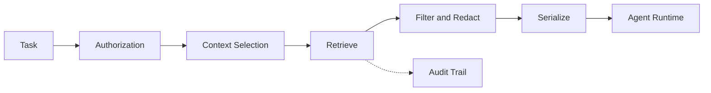

# Chapter 6: The Data Plane

> How agents get the right context without seeing everything.

---

## The Core Problem

Agents need context: documents, records, conversations, tickets, metrics, code, policies, and prior outcomes. Too little context produces shallow answers. Too much context leaks data, wastes tokens, and confuses the model.

The data plane should answer four questions:

1. What data is the agent allowed to see?
2. Which data is relevant to the current task?
3. How should that data be serialized into model context?
4. What data access must be audited?

---

## Data Categories

| Category | Examples | Retrieval Pattern |
|----------|----------|-------------------|
| **Structured records** | Customers, accounts, tickets, orders, entitlements | Filtered API or SQL query |
| **Documents** | Policies, contracts, runbooks, wiki pages | ACL-aware search and retrieval |
| **Conversation history** | Prior chats, ticket comments, email threads | Scoped thread retrieval |
| **Code and configs** | Repositories, pull requests, workflow definitions | Git/API retrieval with branch scope |
| **Metrics and events** | Product telemetry, SLA events, billing anomalies | Time-windowed queries |
| **Policies** | Human-readable rules, OPA/Rego, Cedar, workflow policy | Policy service and digest |
| **Memory** | User preferences, successful fixes, reusable summaries | Memory service with explicit retention |

Do not push all categories through one vector database. Structured records, exact identifiers, and high-cardinality filters usually belong in structured queries.

---

## Context Pipeline



Each stage should be deterministic and testable.

---

## Authorization First

Retrieval must preserve source permissions. If a user cannot read a document or customer record outside the agent, the agent should not read it on their behalf unless a separate approved agent identity explicitly grants that access.

Authorization inputs:

- organization and workspace
- user identity and role
- agent identity and role
- task type
- data classification
- source-system ACLs
- tenant settings
- approval state

Store the authorization decision with the run.

---

## Context Selection

Context selection should combine deterministic selectors and model-assisted search carefully.

Safe selectors:

- direct resource IDs from the task
- ticket/customer/account IDs
- repository and branch
- time window
- owning team
- document collection
- data classification
- allowed source systems

Model-assisted retrieval is useful for broad research, but final retrieval still needs permission checks and source filtering.

---

## Serialization

Give the model compact, source-labeled context.

```markdown
## Ticket
- ID: CASE-123
- Severity: High
- Customer: Acme Corp
- Status: Waiting on support
- Source: crm://case/CASE-123

## Relevant Policy
- External updates require human review for high-severity cases.
- Source: docs://support/escalation-policy#section-4

## Account Signals
- Renewal date: 2026-07-01
- Open incidents in last 30 days: 2
- Source: crm://account/ACME
```

Serialization rules:

- include stable source references
- include timestamps and freshness
- summarize large documents before model input
- separate facts from instructions
- mark untrusted user-provided content
- redact fields that are not required
- cap context size by task type

---

## Retrieval Levels

### Level 1: Preloaded Context

Use when the task has a clear scope.

Examples:

- one ticket
- one document
- one customer account
- one pull request
- one approval request

Preload the exact records and policies the agent needs. This is the fastest and safest path.

### Level 2: Filtered Queries

Use when the agent needs to search structured data.

```typescript
interface QueryTicketsInput {
  customerId?: string;
  severity?: 'low' | 'medium' | 'high' | 'critical';
  status?: 'open' | 'waiting' | 'closed';
  updatedAfter?: string;
  limit: number;
}
```

Filtered queries are better than semantic search for exact IDs, status filters, time windows, owners, and system states.

### Level 3: Keyword Search

Use for documents where exact terms matter: policy names, product names, error codes, legal terms, customer names, and internal acronyms.

Keyword search is also useful as a fallback when vector search returns plausible but wrong results.

### Level 4: Vector Search / RAG

Use for semantic questions across large text corpora.

Good fits:

- knowledge-base search
- policy interpretation
- contract clause lookup
- prior incident or support-case discovery
- internal wiki exploration

Watch out for:

- stale embeddings
- poor chunk boundaries
- missing ACL filters
- irrelevant but semantically similar results
- lack of citations

### Level 5: MCP Resources

MCP resources let an agent discover and read named data sources on demand.

```
resource://tickets/customer/ACME/open
resource://docs/support/escalation-policy
resource://policies/external-communication
resource://reports/revenue-risk/2026-Q2
```

Use resources when the agent may need to browse available context, but still route reads through authorization and audit.

---

## Memory

Memory is durable context that persists beyond one conversation. Treat it as product data.

| Memory Type | Example | Retention Rule |
|-------------|---------|----------------|
| **User preference** | "Prefer concise ticket updates" | User-managed |
| **Team convention** | "Use legal-approved paragraph for refunds" | Team-owned |
| **Task summary** | "CASE-123 summary as of last run" | Expire or refresh |
| **Learned outcome** | "This workflow failed due to missing approval" | Review before reuse |

Memory must have:

- owner
- source
- timestamp
- scope
- retention rule
- delete path
- visibility in the UI

Do not silently store sensitive conversation content as long-term memory.

---

## Freshness

Agents fail when they act on stale data.

| Data | Typical Freshness Need |
|------|------------------------|
| Ticket status | Seconds to minutes |
| Customer entitlements | Minutes |
| Documents and policies | Hours to days |
| Metrics and events | Task-dependent time window |
| Repository content | Current branch head |
| Long-term memory | Explicit refresh or invalidation |

When freshness matters, show it to the model:

```markdown
Data freshness:
- Ticket CASE-123 read at 2026-05-08T10:30:00Z
- Account record read at 2026-05-08T10:30:02Z
- Policy document version: 2026-04-15
```

---

## Storage Choices

| Store | Use For |
|-------|---------|
| **PostgreSQL** | Run state, structured records, audit metadata, JSON payloads |
| **Object storage** | Files, artifacts, exports, generated reports |
| **Search engine** | Keyword document search |
| **Vector database / pgvector** | Semantic document retrieval |
| **Redis** | Ephemeral cache, locks, streams |
| **Managed memory service** | Platform-provided short/long-term memory |

Start with the storage you already operate. Add specialized stores only when traces show the current approach fails.

---

## Design Checklist

- [ ] Retrieval preserves source-system ACLs
- [ ] Every context item includes a source reference
- [ ] Structured records use filtered queries before vector search
- [ ] Untrusted content is labeled before model input
- [ ] Sensitive fields are redacted or withheld
- [ ] Data freshness is tracked and exposed when relevant
- [ ] Long-term memory has owner, scope, retention, and delete semantics
- [ ] Data access is recorded in the audit trail
