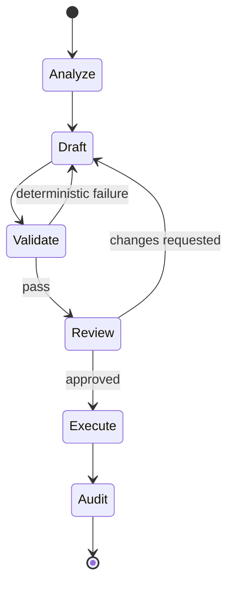

# Chapter 7: Change Control & Action Delivery

> How agent output becomes real work without bypassing review.

---

## The Core Problem

Agents are good at producing plausible work. Plausible is not enough for enterprise systems. Before an agent's output affects customers, money, records, permissions, code, or workflows, it needs deterministic validation and the right approval path.

The default pattern:

```
Analyze -> Draft -> Validate -> Review -> Execute -> Audit
```

Execution should be a separate step from generation.

---

## Action Types

| Action | Safer Default | Validation |
|--------|---------------|------------|
| Customer message | Draft for human review | policy check, tone, citations, PII redaction |
| Ticket update | Draft comment or internal note | status transition rules, required fields |
| Code change | Branch and pull request | tests, lint, security scan, owner review |
| Document change | Suggested edit | doc owner review, versioning |
| Data mutation | Staged mutation request | schema, permissions, duplicate check |
| Workflow action | Approval request | entitlement, preconditions, rollback plan |
| External API call | Dry-run or preview | side-effect classification, rate limit, approval |

---

## Draft-Review-Execute Flow



The agent can iterate between Draft and Validate within limits. Human review owns the transition into high-impact execution.

---

## Deterministic Validation

Use tools that return hard pass/fail signals.

| Domain | Validators |
|--------|------------|
| Text/content | required citations, forbidden terms, PII scan, tone policy, length limits |
| Tickets/workflows | required fields, state-transition rules, duplicate detection |
| Code | tests, lint, typecheck, dependency/security scan, code owners |
| Data updates | schema validation, referential integrity, dry-run mutation |
| API calls | contract test, idempotency key, preview endpoint |
| Documents | style guide, legal clause check, version conflict check |

Validation output should be structured so the agent can correct it.

```typescript
interface ValidationResult {
  passed: boolean;
  findings: Array<{
    code: string;
    severity: 'info' | 'warning' | 'error';
    message: string;
    location?: string;
    suggestedFix?: string;
  }>;
}
```

---

## Pull Requests

Pull requests are the safest delivery path for code, config, prompt, workflow, policy, and documentation changes.

Agent-created PRs should include:

- task link and run ID
- summary of the change
- validation results
- data sources consulted
- policy decisions
- known limitations
- generated artifacts
- reviewer checklist

Branch names should make provenance obvious:

```
agent/support-draft-template/CASE-123/a8f31c
agent/workflow-policy-update/REQ-456/b91d02
agent/report-generator-fix/RUN-789/c77aa0
```

Never hide agent authorship. Reviewers need to know what they are reviewing.

---

## Approval Gates

Gate on risk, not on whether the work was generated by AI.

| Gate | Trigger |
|------|---------|
| **No gate** | Read-only summaries and private drafts |
| **Peer review** | Code/config/doc changes |
| **Owner approval** | Business workflow transitions |
| **Manager approval** | Customer-impacting or financial actions |
| **Security/legal approval** | Sensitive data, policy exceptions, regulated content |
| **Admin approval** | Permission changes and integration configuration |

Approval records should include exact proposed action, approver, timestamp, policy decision, and any modifications made after approval.

---

## Direct Execution

Direct execution is appropriate only when all of these are true:

- action is narrow and well typed
- permissions are scoped to that action
- inputs are validated
- action is idempotent or compensatable
- audit is complete
- policy explicitly allows the task type
- blast radius is acceptable

Examples:

- labeling a ticket
- refreshing a report cache
- creating an internal draft
- adding a non-customer-visible comment
- triggering a read-only export

Do not use direct execution for broad, ambiguous tools such as generic API clients unless they are wrapped by policy.

---

## Idempotency and Compensation

Every executable tool should define:

- idempotency key
- duplicate detection
- retry behavior
- rollback or compensation path
- timeout behavior
- partial failure behavior

Example:

```typescript
await workflow.requestExecution({
  workflowId: "renewal-risk-review",
  input,
  idempotencyKey: `agent-run:${runId}:renewal-risk-review`,
  approvalId,
});
```

If rollback is impossible, require a stronger approval gate.

---

## Human Feedback Loop

When a reviewer changes agent output, store that signal.

Useful feedback events:

- approved without changes
- approved with edits
- rejected
- requested more context
- validation missed an issue
- policy blocked correctly
- policy blocked incorrectly

Use feedback to improve prompts, skills, validators, retrieval, and policy. Do not automatically train or store sensitive content without explicit data-governance review.

---

## Action Report Template

```markdown
## Agent Run
- Run ID: run_123
- Agent: support-drafter
- Task: Draft update for CASE-123
- Policy tier: Draft only

## Proposed Action
Create a customer-facing ticket update draft.

## Sources
- crm://case/CASE-123
- docs://support/escalation-policy#section-4

## Validation
- PII scan: passed
- Required citation check: passed
- External communication policy: passed

## Human Review
- Required: yes
- Reviewer group: support-leads
```

---

## Design Checklist

- [ ] Every action type has a default delivery path
- [ ] Draft and execute are separate tools for high-risk actions
- [ ] Deterministic validators run before review or execution
- [ ] Approval records include exact proposed action and policy context
- [ ] Pull requests identify agent authorship and run ID
- [ ] Executable tools define idempotency and compensation behavior
- [ ] Reviewer feedback is captured for improvement
