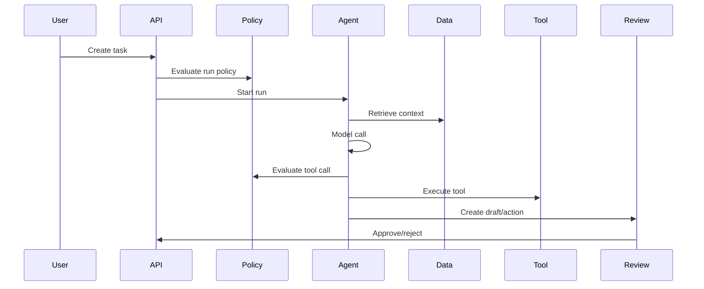

# Chapter 9: Observability & Audit

> How to debug, measure, and audit enterprise agents in production.

---

## The Core Problem

When an agent makes a bad decision, you need to know why. Standard application logs are not enough. You need to see the task, policy, model calls, retrieved context, tool calls, credentials, approvals, and final actions as one trace.

Observability has three audiences:

- **Developers** need to debug behavior and latency.
- **Operators** need reliability, cost, and alerting signals.
- **Risk and compliance teams** need audit-grade records of access and action.

---

## Trace Shape



Every arrow should have a structured event.

---

## Required Events

| Event | Fields |
|-------|--------|
| `agent.run.created` | run ID, tenant, user, agent, task type, trigger |
| `agent.policy.decision` | policy version, allowed/denied, reason, constraints |
| `agent.model.call` | model, prompt version, token counts, latency, cost estimate |
| `agent.context.read` | source, record/document ID, data class, freshness |
| `agent.tool.call` | tool, input hash, side-effect level, duration, status |
| `agent.credential.grant` | grant ID, intent, scope, TTL, identity mode |
| `agent.validation.result` | validator, pass/fail, findings |
| `agent.approval.decision` | approver, action ID, approved/rejected, timestamp |
| `agent.action.executed` | external system, action type, resource ID, result |
| `agent.run.completed` | status, summary, cost, duration |

Do not store raw secrets or unnecessary sensitive payloads in these events. Store hashes, redacted summaries, and secure references where needed.

---

## OpenTelemetry

Use OpenTelemetry spans for request and tool traces.

```typescript
const span = tracer.startSpan("agent.tool.call", {
  attributes: {
    "agent.run_id": run.id,
    "agent.name": run.agentSlug,
    "tool.name": tool.name,
    "tool.side_effect": tool.sideEffect,
    "tenant.id": run.organizationId,
  },
});

try {
  const result = await executeTool(call);
  span.setAttribute("tool.status", "success");
  return result;
} catch (err) {
  span.recordException(err);
  span.setAttribute("tool.status", "error");
  throw err;
} finally {
  span.end();
}
```

Use consistent attributes across runtimes so traces can be compared.

Recommended attributes:

- `agent.run_id`
- `agent.name`
- `agent.version`
- `agent.task_type`
- `model.name`
- `model.provider`
- `prompt.version`
- `tool.name`
- `tool.side_effect`
- `policy.version`
- `policy.decision`
- `tenant.id`
- `user.id_hash`

---

## Model Observability

Track:

- token counts
- latency
- cost
- model name/version
- prompt version
- tool-call count
- stop reason
- refusal/blocked rate
- retry count
- context size
- output validation failures

Do not log full prompts by default in sensitive environments. Use configurable sampling, redaction, secure storage, and access controls for prompt inspection.

---

## Tool Observability

Tool traces should show:

- called tool
- policy decision
- credential grant
- sanitized input
- sanitized output
- external system status code
- latency
- retry count
- side-effect summary
- audit ID from external system, if available

For mutating tools, the action event should include enough information to reconstruct what changed.

---

## Audit Trail

Audit logs should be append-only and tamper-evident where possible.

Minimum audit questions:

- Who or what triggered the run?
- Which user or agent identity was used?
- What policy version applied?
- What data was accessed?
- What credentials were issued?
- What tool calls were made?
- What validation passed or failed?
- Who approved the action?
- What external system changed?
- What was the final result?

Separate debug traces from audit records. Debug traces can be sampled and redacted aggressively. Audit records should be durable and queryable.

---

## Provider Observability

Managed platforms can emit part of this telemetry for you:

- [Amazon Bedrock AgentCore Observability](https://docs.aws.amazon.com/bedrock-agentcore/latest/devguide/observability.html) provides tracing, debugging, monitoring, CloudWatch dashboards, and OTEL-compatible telemetry for AgentCore resources.
- Microsoft Foundry Agent Service includes tracing, evaluation, publishing, and monitoring workflows through Foundry and Azure monitoring surfaces.

Use provider telemetry as an input to your enterprise observability model. You still need application-level events for tenant policy, product approvals, user intent, and business action outcomes.

---

## Metrics

| Metric | Why It Matters |
|--------|----------------|
| Run success rate | Reliability |
| Runs by task type | Adoption and capacity |
| Validation failure rate | Prompt/tool quality |
| Policy denial rate | Misconfiguration or attempted misuse |
| Approval rejection rate | Output quality and risk |
| Tool error rate | Integration reliability |
| Mean run duration | User experience |
| Cost per run | Budget control |
| Data retrieval volume | Privacy and performance |
| External action count | Risk exposure |

Dashboards should break down by agent, task type, tenant, model, and tool.

---

## Alerts

Alert on:

- sudden increase in tool errors
- repeated policy denials for one user or tenant
- unusual data access volume
- high-cost runs
- long-running stuck sessions
- approval bypass attempts
- mutating tool failures
- external action spikes
- redaction failures

Route alerts to the owning team, not a generic inbox.

---

## Privacy and Redaction

Redact before logs leave the process.

Common patterns:

- secrets: API keys, OAuth tokens, session cookies
- identifiers: SSNs, national IDs, bank details
- health or legal data
- passwords and recovery codes
- customer confidential text

Use allowlist logging for sensitive tools: record known safe fields rather than trying to remove all unsafe fields.

---

## Design Checklist

- [ ] Every run has a trace ID and audit ID
- [ ] Policy, tool, credential, data, approval, and action events are recorded
- [ ] Prompts and outputs have redaction and access controls
- [ ] OpenTelemetry attributes are consistent across workers
- [ ] Managed-platform telemetry is joined with application telemetry
- [ ] Mutating actions are audit-grade and queryable
- [ ] Alerts are routed by owning team and severity
- [ ] Cost, latency, and validation metrics are tracked per agent
