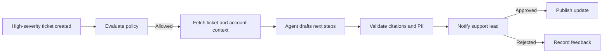

# Chapter 10: Autonomy & Notifications

> How agents run without a human typing a prompt, and how people stay in control.

---

## Autonomy Modes

| Mode | Trigger | Typical Use |
|------|---------|-------------|
| **Interactive** | User starts a session | Research, drafting, support |
| **Event-driven** | Webhook or event stream | New ticket, contract uploaded, PR opened |
| **Scheduled** | Timer | Daily review, weekly report, knowledge refresh |
| **Workflow step** | Business process engine | Approval preparation, routing, validation |
| **Continuous monitor** | Stream or polling loop | SLA breach, anomaly, queue backlog |

Autonomy does not mean unrestricted execution. It means the system can start work without a user prompt, under policy.

---

## Scheduling

Use boring schedulers unless the workflow is durable and complex.

| Scheduler | Best For | Watch Out For |
|-----------|----------|---------------|
| **Cron / systemd timer** | Simple internal jobs | Limited visibility and retry |
| **Kubernetes CronJob** | Containerized platforms | Cluster operations burden |
| **AWS EventBridge Scheduler** | AWS-hosted scheduled tasks | AWS-specific integration |
| **Azure Functions Timer / Logic Apps** | Azure-hosted scheduled tasks | Azure-specific integration |
| **Temporal schedules** | Durable workflows and retries | More platform complexity |
| **Product scheduler table** | SaaS tenant-configured schedules | You own concurrency and recovery |

Every scheduled run should include tenant, schedule ID, policy version, and idempotency key.

---

## Event-Driven Agents

Events should be normalized before dispatch.

```typescript
interface AgentEvent {
  eventId: string;
  source: 'ticket' | 'crm' | 'repo' | 'document' | 'billing' | 'workflow';
  type: string;
  organizationId: string;
  occurredAt: string;
  resourceRef: string;
  dedupeKey: string;
  payload: Record<string, unknown>;
}
```

Event handlers should:

- authenticate the source
- deduplicate events
- load tenant configuration
- evaluate whether an agent should run
- enqueue a task
- emit an audit event

Do not call the model directly from webhook handlers.

---

## Autonomous Workflow Example



The agent starts autonomously, but publication is gated because the message is customer-facing.

---

## Notification Events

Define notification events separately from trace events.

| Event | Severity | Audience |
|-------|----------|----------|
| `agent.run.started` | Info | Optional run subscribers |
| `agent.draft.ready` | Info | Requester or reviewer |
| `agent.approval.required` | Action | Approver group |
| `agent.validation.failed` | Warning | Owner team |
| `agent.policy.denied` | Warning | Requester and admin if repeated |
| `agent.action.executed` | Info/Warning | Requester and affected owner |
| `agent.run.failed` | Warning/Error | Owner team |
| `agent.budget.exceeded` | Warning | Owner team |
| `agent.security.alert` | Critical | Security/on-call |

Notifications should contain the run link, current state, required action, and deadline.

---

## Routing

Routing rules should be tenant-configurable.

```yaml
routes:
  approval_required:
    support:
      channel: teams
      target: "Support Leads"
      deadline: 4h
    finance:
      channel: email
      target: "Finance Approvers"
      deadline: 1d

  security_alert:
    channel: pagerduty
    service: agent-platform-security
    deadline: 15m

  daily_digest:
    channel: email
    target: workspace-admins
    time: "08:00"
```

Use ownership metadata from the task, resource, or tool catalog before falling back to global admins.

---

## Escalation

Escalate when no one responds.

Example:

```
Minute 0:  Teams approval card to workflow owner
Hour 2:    Reminder to owner
Hour 4:    Escalate to manager group
Hour 24:   Expire approval and stop pending action
```

Expiration matters. An approved action should not execute days later against changed context unless policy explicitly allows it.

---

## Digests

Not every run needs a real-time notification. Digests reduce noise.

Digest content:

- runs completed
- approvals pending
- failed validations
- policy denials
- high-cost runs
- top tools used
- feedback requiring review

Let users configure digest frequency, quiet hours, and event categories.

---

## ChatOps

Slack and Teams are natural surfaces for approvals and status. Keep them as control surfaces, not the system of record.

Good ChatOps patterns:

- approval cards link to canonical run page
- buttons call backend approval APIs
- messages show exact proposed action
- comments are synced back to the run
- permissions are checked server-side

Never rely only on channel membership for authorization.

---

## Autonomous Limits

Autonomous agents need stricter limits than interactive runs.

| Limit | Why |
|-------|-----|
| Max runs per tenant per hour | Prevent event storms |
| Max concurrent runs per agent | Protect integrations |
| Max cost per schedule | Control budget |
| Max pending approvals | Prevent review backlog |
| Max data retrieval volume | Protect privacy and source systems |
| Circuit breaker per tool | Stop cascading failures |

When a limit trips, notify the owner and pause the trigger.

---

## Design Checklist

- [ ] Autonomous triggers are authenticated and deduplicated
- [ ] Webhook handlers enqueue tasks instead of calling models directly
- [ ] Schedules have idempotency keys and owner metadata
- [ ] Customer-facing or high-impact actions require approval
- [ ] Notifications include run link, state, required action, and deadline
- [ ] Escalations expire stale approvals
- [ ] Chat approvals are authorized server-side
- [ ] Circuit breakers protect tenants, tools, and budgets
